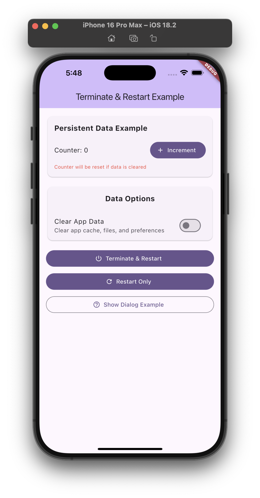

# 🔄 Terminate Restart

[](https://pub.dev/packages/terminate_restart)
[](https://opensource.org/licenses/MIT)
[](https://pub.dev/packages/terminate_restart/score)
[](https://pub.dev/packages/terminate_restart/score)
[](https://pub.dev/packages/terminate_restart/score)

A robust Flutter plugin for terminating and restarting your app with extensive customization options. Perfect for implementing dynamic updates, clearing app state, or refreshing your app's UI.

## 📱 Demo

<div align="center">
  <table>
    <tr>
      <td align="center">
        
        <br>
        <em>Plugin in Action</em>
      </td>
      <td align="center">
        
        <br>
        <em>Clean & Simple Interface</em>
      </td>
    </tr>
  </table>
</div>

The demo showcases:
- 🔄 UI-only restart for quick refreshes
- 🚀 Full app termination and restart
- 🧹 Data clearing with preservation options
- 📝 Customizable confirmation dialogs
- ⚡ Smooth transitions and animations

## 🌟 Features

- ✨ **Two Restart Modes**:
  - UI-only restart (recreate activities/views)
  - Full process termination and restart
- 🧹 **Smart Data Management**:
  - Optional data clearing during restart
  - Configurable data preservation options
  - Proper cleanup of app state
- 🔒 **Secure Data Handling**:
  - Preserve keychain data
  - Preserve user defaults/shared preferences
  - Clean process termination
- 📱 **Platform Support**:
  - ✅ Android
  - ✅ iOS
- 🎨 **Rich UI Options**:
  - Customizable confirmation dialogs
  - Immediate mode for quick restarts
  - Beautiful default UI
- ⚡ **Performance**:
  - Minimal initialization delay
  - Optimized process handling
  - Clean state management

## 📦 Installation

Add this to your package's `pubspec.yaml` file:

```yaml
dependencies:
  terminate_restart: ^1.0.0
```

## 🚀 Getting Started

### Basic Usage

```dart
import 'package:terminate_restart/terminate_restart.dart';

// Simple UI-only restart
await TerminateRestart.restartApp(
  terminate: false, // false for UI-only restart
);

// Full process termination and restart
await TerminateRestart.restartApp(
  terminate: true, // true for full process termination
);
```

### Advanced Usage with Data Clearing

```dart
// Restart with data clearing
await TerminateRestart.restartApp(
  clearData: true, // Clear app data
  preserveKeychain: true, // Keep sensitive data
  preserveUserDefaults: false, // Clear preferences
  terminate: true, // Full process restart
);
```

### Confirmation Dialog

```dart
// Restart with custom confirmation dialog
await TerminateRestart.restartApp(
  context: context, // Required for dialog
  mode: RestartMode.withConfirmation,
  dialogTitle: '✨ Update Ready!',
  dialogMessage: 'Restart now to apply updates?',
  restartNowText: '🚀 Restart Now',
  restartLaterText: '⏰ Later',
  cancelText: '❌ Cancel',
);
```

### Error Handling

```dart
try {
  final success = await TerminateRestart.restartApp(
    terminate: true,
    clearData: true,
  );
  
  if (!success) {
    print('Restart cancelled or failed');
  }
} catch (e) {
  print('Error during restart: $e');
}
```

## 🔧 Configuration Options

| Option | Type | Default | Description |
|--------|------|---------|-------------|
| `context` | `BuildContext?` | `null` | Required for confirmation dialog |
| `mode` | `RestartMode` | `immediate` | Restart mode (immediate/confirmation) |
| `clearData` | `bool` | `false` | Clear app data during restart |
| `preserveKeychain` | `bool` | `false` | Keep keychain data when clearing |
| `preserveUserDefaults` | `bool` | `false` | Keep user defaults when clearing |
| `terminate` | `bool` | `true` | Full termination vs UI-only restart |

## 🛡️ Error Handling

The plugin includes comprehensive error handling:

```dart
try {
  await TerminateRestart.restartApp(
    clearData: true,
  );
} catch (e) {
  print('Restart failed: $e');
  // Handle the error appropriately
}
```

## 🔍 Common Use Cases

1. **After Dynamic Updates**
   ```dart
   // After downloading new assets/code
   await TerminateRestart.restartApp(
     context: context,
     mode: RestartMode.withConfirmation,
     dialogTitle: 'Update Ready',
     dialogMessage: 'Restart to apply updates?',
   );
   ```

2. **Clearing Cache**
   ```dart
   // Clear app data but preserve important settings
   await TerminateRestart.restartApp(
     clearData: true,
     preserveKeychain: true,
     preserveUserDefaults: true,
   );
   ```

3. **Quick UI Refresh**
   ```dart
   // Refresh UI without full restart
   await TerminateRestart.restartApp(
     terminate: false,
   );
   ```

## 📱 Platform-Specific Notes

### Android
- Uses `Process.killProcess()` for clean termination
- Handles activity recreation properly
- Manages app data clearing through proper Android APIs

### iOS
- Implements clean process termination
- Handles UserDefaults and Keychain data preservation
- Manages view controller recreation for UI-only restarts

## 🤝 Contributing

Contributions are welcome! Here's how you can help:

1. Fork the repository
2. Create your feature branch (`git checkout -b feature/amazing`)
3. Commit your changes (`git commit -am 'Add amazing feature'`)
4. Push to the branch (`git push origin feature/amazing`)
5. Open a Pull Request

## 📄 License

This project is licensed under the MIT License - see the [LICENSE](LICENSE) file for details.

## 🙏 Acknowledgments

Special thanks to:
- The Flutter team for the amazing framework
- All contributors who helped improve this plugin
- The community for valuable feedback and suggestions

## 📞 Support

If you have any questions or need help, you can:
- Open an [issue](https://github.com/sleem2012/terminate_restart/issues)
- Check our [example app](example) for more usage examples
- Read our [API documentation](https://pub.dev/documentation/terminate_restart/latest/)

## 📚 Complete Example

Check out our [example app](example) for a full demonstration of all features, including:

- Basic UI/Process restart
- Data clearing with preservation options
- Custom confirmation dialogs
- Error handling
- State management
- Platform-specific features

## 🎥 Demo

### Quick Preview


### Video Tutorial
https://github.com/sleem2012/terminate_restart/assets/video/demo.mp4

<video width="320" height="240" controls>
  <source src="https://github.com/sleem2012/terminate_restart/assets/video/demo.mp4" type="video/mp4">
  Your browser does not support the video tag.
</video>

## 📱 Screenshots

<div style="display: flex; flex-direction: row;">
  
  
  
</div>

## 🔧 Platform-Specific Details

### Android Implementation

The Android implementation uses a combination of techniques to ensure reliable app restart:

```kotlin
// Activity recreation (UI-only restart)
currentActivity.recreate()

// Full process termination
Process.killProcess(Process.myPid())
exitProcess(0)

// Smart Intent handling
intent.addFlags(Intent.FLAG_ACTIVITY_NEW_TASK or Intent.FLAG_ACTIVITY_CLEAR_TASK)
```

### iOS Implementation

The iOS implementation provides:

- Clean process termination
- State preservation options
- Keychain data handling
- User defaults management

## 👨‍💻 Author

Made with ❤️ by Ahmed Sleem

---

<p align="center">
  <a href="https://github.com/sleem2012/terminate_restart">GitHub</a> •
  <a href="https://pub.dev/packages/terminate_restart">pub.dev</a> •
  <a href="https://github.com/sleem2012/terminate_restart/issues">Issues</a>
</p>

## 🎯 Real-World Examples

### 1. Theme Switching

```dart
class ThemeManager {
  static Future<void> switchTheme() async {
    // Save new theme
    await prefs.setString('theme', 'dark');
    
    // Restart UI only to apply theme
    await TerminateRestart.restartApp(
      terminate: false,
    );
  }
}
```

### 2. Language Change

```dart
class LocalizationManager {
  static Future<void> changeLanguage(String locale) async {
    // Save new locale
    await prefs.setString('locale', locale);
    
    // Show confirmation with custom message
    await TerminateRestart.restartApp(
      context: context,
      mode: RestartMode.withConfirmation,
      dialogTitle: 'Language Changed',
      dialogMessage: 'Restart app to apply new language?',
      restartNowText: 'Restart Now',
      restartLaterText: 'Later',
    );
  }
}
```

### 3. App Update

```dart
class UpdateManager {
  static Future<void> applyUpdate() async {
    try {
      // Download and save update
      await downloadUpdate();
      
      // Clear cache but preserve settings
      await TerminateRestart.restartApp(
        context: context,
        mode: RestartMode.withConfirmation,
        clearData: true,
        preserveUserDefaults: true,
        preserveKeychain: true,
        dialogTitle: 'Update Ready',
        dialogMessage: 'Restart to complete update?',
      );
    } catch (e) {
      print('Update failed: $e');
    }
  }
}
```

### 4. User Logout

```dart
class AuthManager {
  static Future<void> logout() async {
    try {
      // Clear all data except keychain
      await TerminateRestart.restartApp(
        clearData: true,
        preserveKeychain: true,
        terminate: true, // Full restart for security
      );
    } catch (e) {
      print('Logout failed: $e');
    }
  }
}
```

## 🔧 Configuration Options

| Option | Type | Default | Description |
|--------|------|---------|-------------|
| `context` | `BuildContext?` | `null` | Required for confirmation dialog |
| `mode` | `RestartMode` | `immediate` | Restart mode (immediate/confirmation) |
| `clearData` | `bool` | `false` | Clear app data during restart |
| `preserveKeychain` | `bool` | `false` | Keep keychain data when clearing |
| `preserveUserDefaults` | `bool` | `false` | Keep user defaults when clearing |
| `terminate` | `bool` | `true` | Full termination vs UI-only restart |

## 🛡️ Error Handling

### Common Errors and Solutions

1. **Context Error**
```dart
try {
  await TerminateRestart.restartApp(
    context: context,
    mode: RestartMode.withConfirmation,
  );
} on ArgumentError catch (e) {
  // Handle invalid or disposed context
  print('Context error: $e');
} catch (e) {
  print('Other error: $e');
}
```

2. **Data Clearing Error**
```dart
try {
  await TerminateRestart.restartApp(
    clearData: true,
    preserveKeychain: true,
  );
} on PlatformException catch (e) {
  // Handle platform-specific errors
  print('Platform error: $e');
} catch (e) {
  print('Other error: $e');
}
```

3. **Timeout Handling**
```dart
try {
  await TerminateRestart.restartApp().timeout(
    Duration(seconds: 5),
    onTimeout: () {
      throw TimeoutException('Restart timed out');
    },
  );
} on TimeoutException catch (e) {
  print('Timeout: $e');
}
```

## 📱 Platform-Specific Notes

### Android
- Uses `Process.killProcess()` for clean termination
- Handles activity recreation properly
- Manages app data clearing through proper Android APIs
- Supports custom intent flags
- Handles task stack management

### iOS
- Implements clean process termination
- Handles UserDefaults and Keychain data preservation
- Manages view controller recreation for UI-only restarts
- Supports background task completion
- Handles state restoration

## 🔍 Best Practices

1. **Data Preservation**
```dart
// Always preserve sensitive data
await TerminateRestart.restartApp(
  clearData: true,
  preserveKeychain: true, // Keep credentials
  preserveUserDefaults: true, // Keep important settings
);
```

2. **User Experience**
```dart
// Show progress during long operations
showDialog(
  context: context,
  barrierDismissible: false,
  builder: (context) => const CircularProgressIndicator(),
);

await TerminateRestart.restartApp(
  clearData: true,
);
```

3. **Error Recovery**
```dart
Future<void> safeRestart() async {
  int retryCount = 0;
  while (retryCount < 3) {
    try {
      await TerminateRestart.restartApp();
      break;
    } catch (e) {
      retryCount++;
      await Future.delayed(Duration(seconds: 1));
    }
  }
}

```

## ❓ FAQ

### General Questions

1. **Q: What's the difference between UI-only restart and full termination?**
   
   A: 
   - UI-only restart recreates the app's interface without killing the process
   - Full termination completely kills and restarts the app process
   - UI-only is faster but may not clear all state
   - Full termination ensures a completely fresh start

2. **Q: Is it safe to clear data during restart?**
   
   A: Yes! The plugin provides granular control:
   - `preserveKeychain`: Keep sensitive data like credentials
   - `preserveUserDefaults`: Keep important settings
   - Data clearing is atomic - either succeeds completely or fails safely

3. **Q: Will this work with my state management solution?**
   
   A: Yes, works with all major state management solutions:
   - Provider
   - Bloc/Cubit
   - GetX
   - Riverpod
   Just ensure proper state cleanup in your dispose methods.

4. **Q: Can I use this with Shorebird/CodePush?**
   
   A: Absolutely! Perfect for applying dynamic updates:
   ```dart
   // After Shorebird update
   await TerminateRestart.restartApp(
     context: context,
     mode: RestartMode.withConfirmation,
     dialogTitle: 'Update Ready',
   );
   ```

## 🔧 Troubleshooting

### Common Issues

1. **Black Screen After Restart**
   ```dart
   // Solution: Use UI-only restart
   await TerminateRestart.restartApp(
     terminate: false,
   );
   ```

2. **Lost User Data**
   ```dart
   // Solution: Preserve important data
   await TerminateRestart.restartApp(
     clearData: true,
     preserveUserDefaults: true,
     preserveKeychain: true,
   );
   ```

3. **Dialog Not Showing**
   ```dart
   // Solution: Ensure valid context
   await TerminateRestart.restartApp(
     context: context,  // Must be valid and mounted
     mode: RestartMode.withConfirmation,
   );
   ```

4. **Crash on iOS**
   ```dart
   // Solution: Handle background tasks
   await TerminateRestart.restartApp(
     terminate: true,
     // iOS will handle task completion automatically
   );
   ```

### Performance Tips

1. **Minimize Full Restarts**
   ```dart
   // Prefer UI-only restart when possible
   await TerminateRestart.restartApp(
     terminate: false,
   );
   ```

2. **Optimize Data Clearing**
   ```dart
   // Only clear what's necessary
   await TerminateRestart.restartApp(
     clearData: true,
     preserveKeychain: true,  // Keep if not needed
     preserveUserDefaults: true,  // Keep if not needed
   );
   ```

3. **Handle Long Operations**
   ```dart
   // Show progress for long operations
   showDialog(
     context: context,
     builder: (_) => LoadingDialog(),
   );
   
   await TerminateRestart.restartApp(
     clearData: true,
   );
   ```

## 📊 Performance Metrics

| Operation | Average Time |
|-----------|-------------|
| UI-only Restart | ~300ms |
| Full Termination | ~800ms |
| Data Clearing | ~200ms |
| With Dialog | +100ms |

## 🔐 Security Considerations

1. **Sensitive Data**
   - Use `preserveKeychain` for credentials
   - Clear data on logout
   - Handle biometric authentication state

2. **State Management**
   - Clear sensitive state before restart
   - Handle authentication tokens properly
   - Manage secure storage access

3. **Platform Security**
   - Proper permission handling
   - Secure data clearing
   - Protected file access
