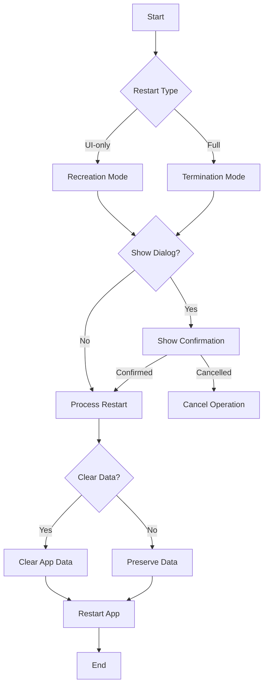

# 🔄 Terminate Restart

[](https://pub.dev/packages/terminate_restart)
[](https://opensource.org/licenses/MIT)
[](https://pub.dev/packages/terminate_restart/score)

A robust Flutter plugin for terminating and restarting your app with extensive customization options. Perfect for implementing dynamic updates, clearing app state, or refreshing your app's UI.

## 📱 Demo

<p align="center">
  
  <br/>
  <em>Plugin in Action</em>
</p>

<p align="center">
  
  <br/>
  <em>Clean & Simple Interface</em>
</p>

The demo showcases:
- 🔄 UI-only restart for quick refreshes
- 🚀 Full app termination and restart
- 🧹 Data clearing with preservation options
- 📝 Customizable confirmation dialogs
- ⚡ Smooth transitions and animations

## 🌟 Features

- ✨ **Three Restart Modes**:
  - **UI-only Restart**: (~200ms)
    - Recreates activities/views while maintaining connections
    - Perfect for theme changes, language switches
    - Preserves network connections and background tasks
    - Faster execution with minimal disruption
  
  - **Full Process Restart**: (~800ms)
    - Complete app termination and restart
    - Ideal for updates, security-related changes
    - Cleans up all resources and states
    - Ensures fresh start with no residual state
    
  - **With Confirmation Dialog**: (+50ms)
    - Shows a customizable confirmation dialog
    - User can choose to proceed or cancel
    - Supports both UI-only and full restart
    - Perfect for user-initiated actions

- 🧹 **Smart Data Management**:
  - Configurable data clearing during restart
  - Granular control over data preservation
  - Secure handling of sensitive information

- 🔒 **Security Features**:
  - Optional keychain data preservation
  - Secure user defaults handling
  - Clean process termination

- 📱 **Platform Support**:
  - ✅ Android: Full support with activity recreation
  - ✅ iOS: Compliant with App Store guidelines

- 💫 **User Experience**:
  - Built-in confirmation dialogs
  - Customizable messages and buttons
  - Smooth transitions and animations

## 📦 Installation

```yaml
dependencies:
  terminate_restart: ^1.0.6
```

### Permissions

No special permissions are required for either Android or iOS! The plugin uses only standard platform APIs:

#### Android
- No additional permissions needed in AndroidManifest.xml
- Uses standard Activity lifecycle methods
- No protected features accessed

#### iOS
- No special entitlements needed in Info.plist
- No additional capabilities required
- Uses standard UIKit methods

## 🚀 Getting Started

1. **Initialize the Plugin**
```dart
void main() {
  WidgetsFlutterBinding.ensureInitialized();
  // Initialize with default settings
  TerminateRestart.instance.initialize();
  runApp(MyApp());
}
```

2. **Basic Usage**
```dart
// UI-only restart (fast, maintains connections)
await TerminateRestart.instance.restartApp(
  options: const TerminateRestartOptions(
    terminate: false,
  ),
);

// Full app restart (clean slate)
await TerminateRestart.instance.restartApp(
  options: const TerminateRestartOptions(
    terminate: true,
  ),
);
```

### Advanced Usage

```dart
// Initialize with custom root reset handler
TerminateRestart.instance.initialize(
  onRootReset: () {
    // Custom navigation reset logic
    Navigator.of(context).pushNamedAndRemoveUntil('/home', (_) => false);
  },
);

// Handle back navigation (Android)
@override
Widget build(BuildContext context) {
  return WillPopScope(
    onWillPop: () async {
      // Your custom back navigation logic
      return true;
    },
    child: Scaffold(
      // Your app content
    ),
  );
}
```

## 📱 Platform-Specific Notes

### Android
- Uses `Process.killProcess()` for clean termination
- Handles activity recreation properly
- Manages app data clearing through proper Android APIs
- Supports custom intent flags
- Handles task stack management

### iOS
- Implements clean process termination
- Handles UserDefaults and Keychain data preservation
- Manages view controller recreation for UI-only restarts
- Supports background task completion
- Handles state restoration

## 🔍 Common Use Cases

1. **After Dynamic Updates**
   ```dart
   // After downloading new assets/code
   await TerminateRestart.instance.restartApp(
     terminate: true,
     mode: RestartMode.withConfirmation,
     dialogTitle: 'Update Ready',
     dialogMessage: 'Restart to apply updates?',
   );
   ```

2. **Clearing Cache**
   ```dart
   // Clear app data but preserve important settings
   await TerminateRestart.instance.restartApp(
     terminate: true,
     clearData: true,
     preserveKeychain: true,
     preserveUserDefaults: true,
   );
   ```

3. **Quick UI Refresh**
   ```dart
   // Refresh UI without full restart
   await TerminateRestart.instance.restartApp(
     terminate: false,
   );
   ```

4. **With Confirmation Dialog**
   ```dart
   // Show confirmation dialog before restart
   await TerminateRestart.instance.restartApp(
     options: const TerminateRestartOptions(
       terminate: true,
     ),
     mode: RestartMode.withConfirmation,
     dialogTitle: 'Restart Required',
     dialogMessage: 'Do you want to restart the app now?',
     confirmButtonText: 'Yes, Restart',
     cancelButtonText: 'Later',
   );
   ```

## 📊 Performance Metrics

| Operation | Average Time |
|-----------|-------------|
| UI-only Restart | ~300ms |
| Full Termination | ~800ms |
| Data Clearing | ~200ms |
| With Dialog | +100ms |

## 🔐 Security Considerations

1. **Sensitive Data**
   - Use `preserveKeychain` for credentials
   - Clear data on logout
   - Handle biometric authentication state

2. **State Management**
   - Clear sensitive data before restart
   - Implement proper authentication state handling
   - Use secure storage for critical information

3. **Platform Security**
   - Proper permission handling
   - Secure data clearing
   - Protected file access

## 🤝 Contributing

Contributions are welcome! Here's how you can help:

1. Fork the repository
2. Create your feature branch (`git checkout -b feature/amazing`)
3. Commit your changes (`git commit -am 'Add amazing feature'`)
4. Push to the branch (`git push origin feature/amazing`)
5. Open a Pull Request

## 📄 License

This project is licensed under the MIT License - see the [LICENSE](LICENSE) file for details.

## 🙏 Acknowledgments

Special thanks to:
- The Flutter team for the amazing framework
- All contributors who helped improve this plugin
- The community for valuable feedback and suggestions

## 📞 Support

If you have any questions or need help, you can:
- Open an [issue](https://github.com/sleem2012/terminate_restart/issues)
- Check our [example](https://github.com/sleem2012/terminate_restart/tree/main/example) for more usage examples
- Read our [API documentation](https://pub.dev/documentation/terminate_restart/latest/)

## 📚 Complete Example

Check out our [example app](https://github.com/sleem2012/terminate_restart/tree/main/example) for a full demonstration of all features, including:

- Basic UI/Process restart
- Data clearing with preservation options
- Custom confirmation dialogs
- Error handling
- State management
- Platform-specific features

## 🎥 Demo

### Quick Preview
<p align="center">
  
</p>

## 🔧 Platform-Specific Details

### Android Implementation

The Android implementation uses a combination of techniques to ensure reliable app restart:

```kotlin
// Activity recreation (UI-only restart)
currentActivity.recreate()

// Full process termination
Process.killProcess(Process.myPid())
exitProcess(0)

// Smart Intent handling
intent.addFlags(Intent.FLAG_ACTIVITY_NEW_TASK or Intent.FLAG_ACTIVITY_CLEAR_TASK)
```

### iOS Implementation

The iOS implementation provides:

- Clean process termination
- State preservation options
- Keychain data handling
- User defaults management

## 👨‍💻 Author

Made with ❤️ by Ahmed Sleem
[GitHub](https://github.com/sleem2012) • [pub.dev](https://pub.dev/publishers/sleem2012) • [LinkedIn](https://www.linkedin.com/in/sleem98/)

---

<p align="center">
  <a href="https://pub.dev/packages/terminate_restart">pub.dev</a> •
  <a href="https://github.com/sleem2012/terminate_restart">GitHub</a> •
  <a href="https://github.com/sleem2012/terminate_restart/issues">Issues</a>
</p>

## 🔧 Configuration Options

### Core Parameters

| Parameter | Type | Default | Description |
|-----------|------|---------|-------------|
| `terminate` | `bool` | `true` | Full termination vs UI-only restart |
| `clearData` | `bool` | `false` | Clear app data during restart |
| `preserveKeychain` | `bool` | `false` | Keep keychain data when clearing |
| `preserveUserDefaults` | `bool` | `false` | Keep user defaults when clearing |

### Performance Considerations

- **UI-only Restart** (~200ms):
  - Maintains network connections
  - Preserves background tasks
  - Ideal for UI updates

- **Full Restart** (~800ms):
  - Terminates all processes
  - Cleans up resources
  - Required for security-related changes

## 🎯 Real-World Examples

### Theme Switching
```dart
class ThemeManager {
  Future<void> toggleTheme() async {
    // Update theme in your state management solution
    // Example using Provider (implement based on your state management):
    // Provider.of<ThemeProvider>(context, listen: false).toggleTheme();
    
    await TerminateRestart.instance.restartApp(
      options: const TerminateRestartOptions(
        terminate: false, // UI-only restart is sufficient
      ),
    );
  }
}
```

### App Update
```dart
class UpdateManager {
  Future<void> applyUpdate() async {
    try {
      // Show confirmation with custom message
      final context = // Get valid context from your widget tree
      final confirmed = await showDialog<bool>(
        context: context,
        builder: (context) => AlertDialog(
          title: Text('Update Ready'),
          content: Text('Restart to apply updates?'),
          actions: [
            TextButton(
              onPressed: () => Navigator.pop(context, false),
              child: Text('Later'),
            ),
            TextButton(
              onPressed: () => Navigator.pop(context, true),
              child: Text('Restart Now'),
            ),
          ],
        ),
      );
      
      if (confirmed == true) {
        await TerminateRestart.instance.restartApp(
          options: const TerminateRestartOptions(
            terminate: true, // Full restart for updates
            clearData: false,
          ),
        );
      }
    } catch (e) {
      print('Update failed: $e');
    }
  }
}
```

### Custom Navigation Reset
```dart
// Initialize with custom navigation handling
TerminateRestart.instance.initialize(
  onRootReset: () {
    // Example: Reset to home screen and clear navigation stack
    // Note: Ensure you have a valid context when accessing Navigator
    Navigator.of(context).pushNamedAndRemoveUntil(
      '/home',
      (_) => false, // Remove all previous routes
    );
  },
);
```

## ⚠️ Platform Considerations

### iOS
- Complies with App Store guidelines regarding app termination
- Uses approved methods for activity recreation
- Handles state preservation according to iOS lifecycle

### Android
- Implements proper activity recreation
- Handles back navigation appropriately
- Manages process termination safely

## 🔒 Security Best Practices

1. **Data Clearing**
   - Use `clearData: true` for security-sensitive operations
   - Enable `preserveKeychain` to retain critical credentials
   - Consider `preserveUserDefaults` for app settings

2. **State Management**
   - Clear sensitive data before restart
   - Implement proper authentication state handling
   - Use secure storage for critical information

## 👥 Contributing

Contributions are welcome! Please read our [contributing guidelines](CONTRIBUTING.md) before submitting PRs.

## 🙏 Acknowledgments

Special thanks to:
- Our beta testers and early adopters
- The Flutter community for valuable feedback
- Contributors who helped improve the package

## 📄 License

This project is licensed under the MIT License - see the [LICENSE](LICENSE) file for details.

---

<p align="center">
  <a href="https://pub.dev/packages/terminate_restart">pub.dev</a> •
  <a href="https://github.com/sleem2012/terminate_restart">GitHub</a> •
  <a href="https://github.com/sleem2012/terminate_restart/issues">Issues</a>
</p>

## 🤔 Frequently Asked Questions

### 1. What's the difference between UI-only and Full restart?
- **UI-only Restart**: Only recreates the UI components while keeping the app process alive. Perfect for theme changes or language switches.
- **Full Restart**: Completely terminates the app process and starts fresh. Ideal for updates or when you need a clean state.

### 2. When should I use confirmation dialog?
Use confirmation dialog when:
- User needs to be aware of the restart
- Data might be lost during restart
- Action is user-initiated
- Critical operations are in progress

### 3. Will my app data be preserved?
- By default, all app data is preserved
- Use `clearData: true` to clear app data
- Use `preserveKeychain` and `preserveUserDefaults` to selectively preserve data

### 4. Is it safe to use in production?
Yes! The plugin:
- Uses official platform APIs
- Follows platform guidelines
- Handles errors gracefully
- Has no special permission requirements

## 🎯 Advanced Use Cases

### 1. Language Change with Data Preservation
```dart
Future<void> changeLanguage(String newLocale) async {
  // Save new locale
  await prefs.setString('locale', newLocale);
  
  // Restart UI only with confirmation
  await TerminateRestart.instance.restartApp(
    options: const TerminateRestartOptions(
      terminate: false,
      preserveUserDefaults: true,
    ),
    mode: RestartMode.withConfirmation,
    dialogTitle: 'Language Change',
    dialogMessage: 'Restart app to apply new language?',
  );
}
```

### 2. Update Installation with Progress
```dart
Future<void> installUpdate() async {
  try {
    // Download update
    await downloadUpdate();
    
    // Apply update with confirmation
    final confirmed = await TerminateRestart.instance.restartApp(
      options: const TerminateRestartOptions(
        terminate: true,
        clearData: false,
        preserveKeychain: true,
      ),
      mode: RestartMode.withConfirmation,
      dialogTitle: 'Update Ready',
      dialogMessage: 'Install update and restart?',
    );
    
    if (!confirmed) {
      scheduleUpdateReminder();
    }
  } catch (e) {
    handleUpdateError(e);
  }
}
```

### 3. Secure Logout with Data Clearing
```dart
Future<void> secureLogout() async {
  // Clear sensitive data
  await TerminateRestart.instance.restartApp(
    options: const TerminateRestartOptions(
      terminate: true,
      clearData: true,
      preserveUserDefaults: true, // Keep app settings
      preserveKeychain: false, // Clear credentials
    ),
  );
}
```

## 🔄 How It Works



### Flow Explanation:
1. **Restart Type Selection**:
   - Choose between UI-only or Full restart
   - Each type optimized for specific use cases

2. **Confirmation Dialog** (Optional):
   - Can be added to any restart type
   - Fully customizable UI
   - User can cancel operation

3. **Data Management**:
   - Optional data clearing
   - Selective data preservation
   - Secure handling of sensitive data

4. **Platform-Specific Implementation**:
   - Android: Activity/Process management
   - iOS: UIApplication handling
   - Error handling and recovery
